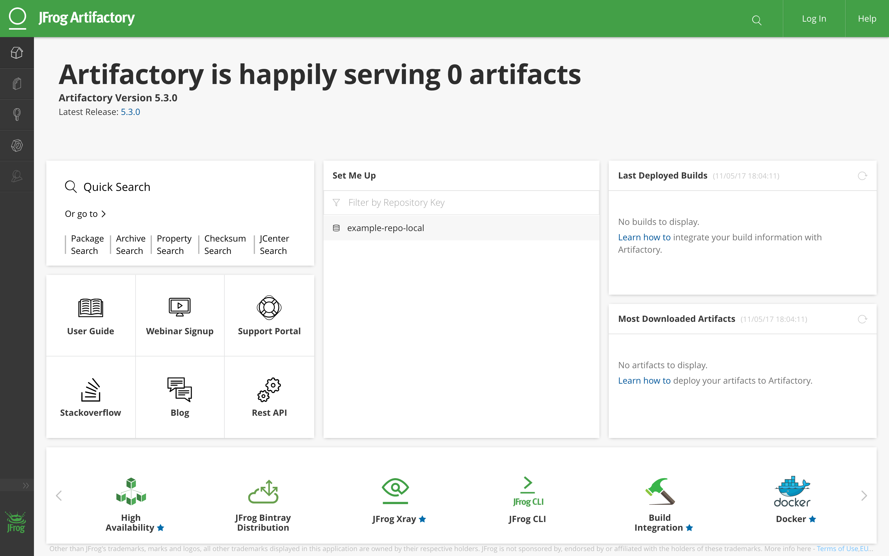

# Ansible Artifactory Stack



This repo contains a vagrant file to create an Artifactory Stack with JMX support, via the following Ansible roles: -

- src: geerlingguy.firewall
- src: geerlingguy.security
- src: geerlingguy.mysql
- src: jpnewman.common
- src: jpnewman.java
- src: jpnewman.locale-timezone
- src: jpnewman.apache
- src: jpnewman.artifactory

For more information look at the following readmes: -

- ```./Vagrantfiles/SingleServer/README.md```

# Install Vagrant Plugin

~~~bash
vagrant plugin install vagrant-triggers
vagrant plugin install vagrant-cachier
vagrant plugin install vagrant-hostmanager
~~~

# Install Python requirements

~~~bash
sudo pip install -r requirements.txt
~~~

# Install Ansible Roles

~~~bash
ansible-galaxy install -r requirements.yml -p roles
~~~

# Run

~~~
cd ./Vagrantfiles/SingleServer

vagrant up
~~~

# Testing

~~~
ansible-playbook --syntax-check --list-tasks playbook.yml -i .vagrant/provisioners/ansible/inventory/vagrant_ansible_inventory
~~~

## License

MIT / BSD

## Author Information

John Paul Newman
